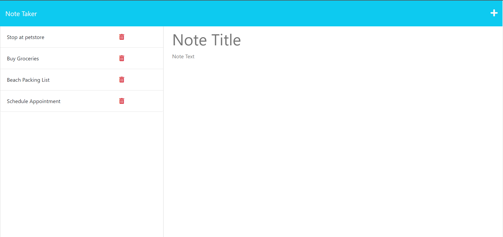
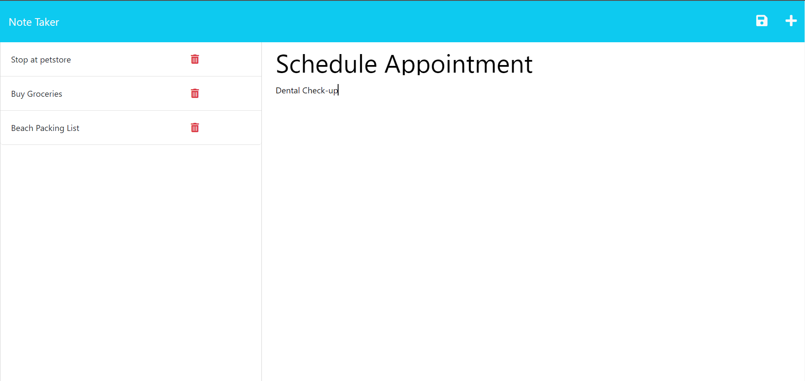

# Note Taker

    
## Table of Contents
* [Description](#description)
* [Built-With](#built-with)
* [Demo](#demo)
* [Installation](#installation)
* [Usage](#usage)
* [License](#license)
* [Contributing](#contributing)
* [Tests](#tests)
* [Questions](#questions)

## Description
    
This is a dynamic application that writes and saves notes based on user input. It uses an Express.js back end which saves and retrieves note data from a JSON file.

## Built-With

  
  
  
  
  
  
  

## Demo

The following images display the web application's appearance and functionality:

## Installation

There is no installation required for this website. The webpage can be found by clicking the link below:

[Note-Taker-Heroku]()

## Usage

Once on the homepage, click on the "Get Started" button to be taken to the notes page. On the notes page, you may add a new note title and note text, and then click the save icon to the top-right. The saved note will then appear on the left-hand side of the page. You may also delete notes from the list by clicking their respective delete icon.

## License
        
    MIT

## Contributing

Not currently accepting contributions to this project.

## Tests

N/A

## Questions

If there are additional questions, please reach out to me here: 

* GitHub: https://github.com/Carolinapalacios95
* Email: carolina.palacios1995@gmail.com
